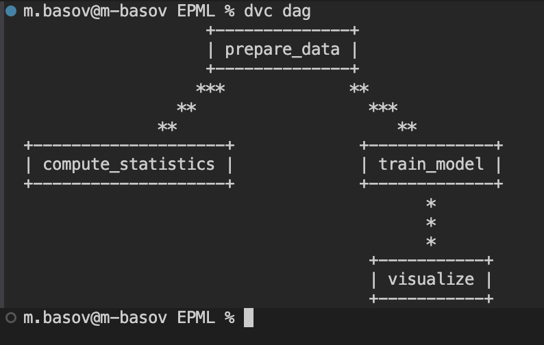
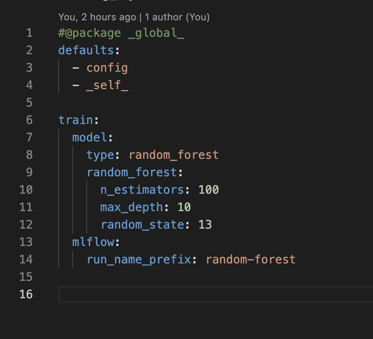
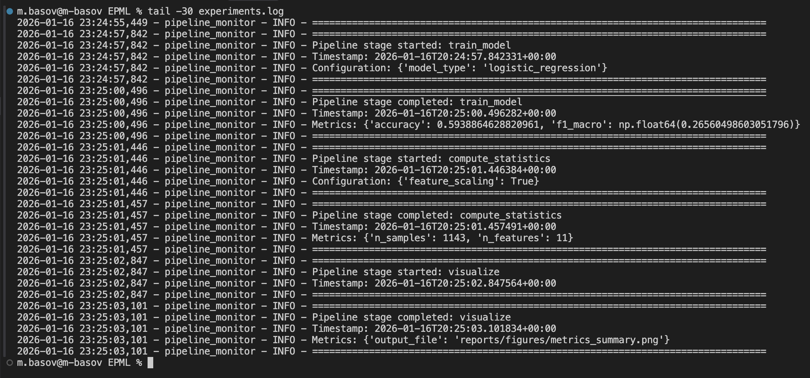
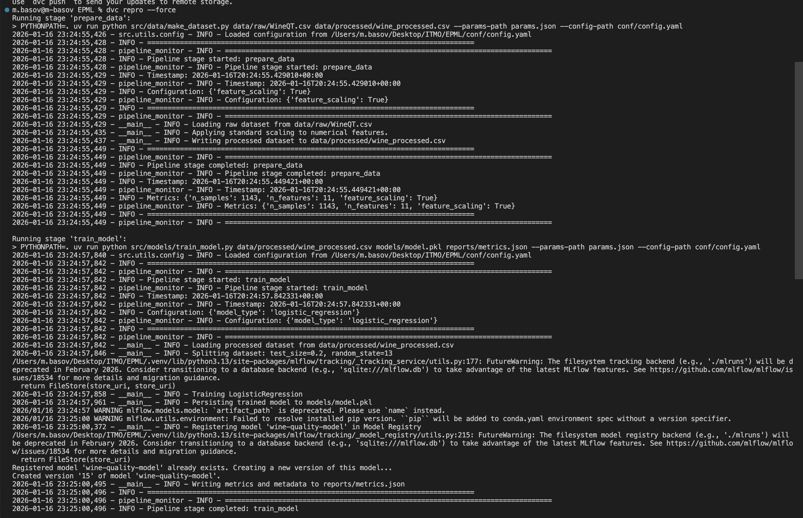
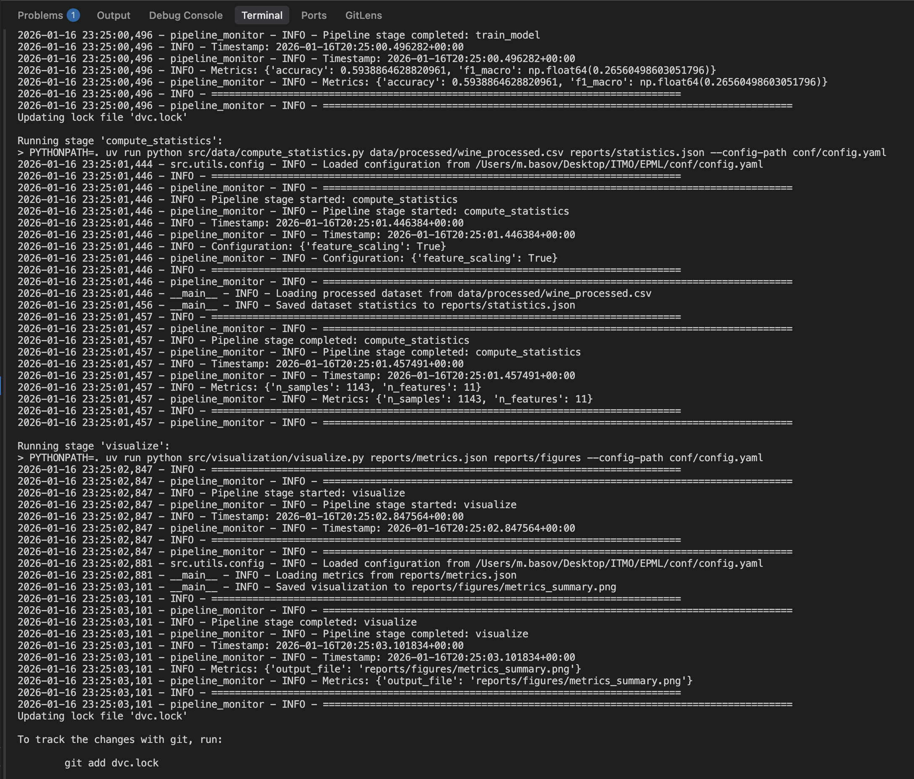

# ДЗ 4 — Автоматизация ML пайплайнов

## Выбранные инструменты

| Категория | Инструмент |
|-----------|------------|
| Оркестрация | DVC Pipelines |
| Конфигурации | Hydra (`@hydra.main`) |

---

## 1. Настройка DVC Pipelines (4 балла)

### 1.1 Установка и настройка

DVC установлен через `uv`:
```bash
uv add dvc
```

Конфигурация пайплайна в `dvc.yaml`:
```yaml
stages:
  prepare_data:
    cmd: PYTHONPATH=. uv run python src/data/make_dataset.py
    deps:
    - src/data/make_dataset.py
    - data/raw/WineQT.csv
    - conf/config.yaml
    params:
    - conf/config.yaml:
      - data
      - paths.raw_data
      - paths.processed_data
    outs:
    - data/processed/wine_processed.csv

  train_model:
    cmd: PYTHONPATH=. uv run python src/models/train_model.py
    deps:
    - data/processed/wine_processed.csv
    - src/models/train_model.py
    - conf/config.yaml
    params:
    - conf/config.yaml:
      - train
      - paths.processed_data
      - paths.model
      - paths.metrics
    outs:
    - models/model.pkl
    metrics:
    - reports/metrics.json:
        cache: false

  compute_statistics:
    cmd: PYTHONPATH=. uv run python src/data/compute_statistics.py
    deps:
    - data/processed/wine_processed.csv
    - src/data/compute_statistics.py
    - conf/config.yaml
    outs:
    - reports/statistics.json

  visualize:
    cmd: PYTHONPATH=. uv run python src/visualization/visualize.py
    deps:
    - reports/metrics.json
    - src/visualization/visualize.py
    - conf/config.yaml
    outs:
    - reports/figures/metrics_summary.png
```

### 1.2 Структура пайплайна (DAG)

```
                   +--------------+
                   | prepare_data |
                   +--------------+
                  ***             **
                **                  ***
              **                       **
+--------------------+             +-------------+
| compute_statistics |             | train_model |
+--------------------+             +-------------+
                                          *
                                          *
                                          *
                                    +-----------+
                                    | visualize |
                                    +-----------+
```

**Этапы пайплайна:**
1. **prepare_data** — загрузка и подготовка данных
2. **compute_statistics** — вычисление статистик датасета (параллельно с train_model)
3. **train_model** — обучение модели (параллельно с compute_statistics)
4. **visualize** — визуализация метрик (после train_model)



---

## 2. Настройка Hydra (4 балла)

### 2.1 Использование `@hydra.main` декоратора

Все скрипты используют декоратор `@hydra.main`:

```python
# src/models/train_model.py
@hydra.main(config_path="../../conf", config_name="config", version_base=None)
def main(cfg: DictConfig) -> None:
    model_type = cfg.train.model.type
    processed_path = Path(cfg.paths.processed_data)
    ...
```

### 2.2 Базовая конфигурация

```yaml
# conf/config.yaml
paths:
  raw_data: data/raw/WineQT.csv
  processed_data: data/processed/wine_processed.csv
  model: models/model.pkl
  metrics: reports/metrics.json
  statistics: reports/statistics.json
  figures: reports/figures

data:
  feature_scaling: true

train:
  random_state: 13
  test_size: 0.2
  model:
    type: logistic_regression
    logistic_regression:
      max_iter: 500
      C: 1.0
      penalty: l2
      solver: lbfgs
  mlflow:
    experiment_name: wine-quality
    run_name_prefix: baseline
    model_name: wine-quality-model

monitoring:
  log_file: experiments.log
  enabled: true

hydra:
  run:
    dir: .
  output_subdir: null
```

### 2.3 Композиция конфигураций через defaults

```yaml
# conf/config_rf.yaml
defaults:
  - config      # Наследует базовый конфиг
  - _self_      # Переопределяет своими значениями

train:
  model:
    type: random_forest
    random_forest:
      n_estimators: 100
      max_depth: 10
      random_state: 13
  mlflow:
    run_name_prefix: random-forest
```

**Доступные конфигурации:**
- `config.yaml` — базовый конфиг (Logistic Regression)
- `config_rf.yaml` — Random Forest
- `config_svm.yaml` — SVM
- `config_logistic.yaml` — Logistic Regression (явный)



### 2.4 CLI overrides

```bash
# Выбор конфига
PYTHONPATH=. uv run python src/models/train_model.py --config-name=config_rf

# Override параметров
PYTHONPATH=. uv run python src/models/train_model.py train.model.random_forest.n_estimators=200

# Комбинация
PYTHONPATH=. uv run python src/models/train_model.py --config-name=config_rf train.test_size=0.3
```

---

## 3. Интеграция и тестирование (2 балла)

### 3.1 Система мониторинга выполнения

Модуль `src/utils/monitoring.py` предоставляет:

- **`setup_monitoring(cfg)`** — настройка логгера из конфига
- **`log_pipeline_start(logger, stage, config)`** — лог начала этапа
- **`log_pipeline_end(logger, stage, metrics)`** — лог завершения этапа
- **`@log_function_call()`** — декоратор для автоматического логирования

### 3.2 Уведомления о результатах

Логи записываются в `experiments.log` и выводятся в консоль:

```
================================================================================
2026-01-16 23:24:57 - pipeline_monitor - INFO - Pipeline stage started: train_model
2026-01-16 23:24:57 - pipeline_monitor - INFO - Timestamp: 2026-01-16T20:24:57+00:00
2026-01-16 23:24:57 - pipeline_monitor - INFO - Configuration: {'model_type': 'logistic_regression'}
================================================================================
2026-01-16 23:25:00 - pipeline_monitor - INFO - Pipeline stage completed: train_model
2026-01-16 23:25:00 - pipeline_monitor - INFO - Metrics: {'accuracy': 0.594, 'f1_macro': 0.266}
================================================================================
```



### 3.3 Тестирование воспроизводимости

Полный запуск пайплайна с нуля:
```bash
# Установка зависимостей
uv sync --frozen

# Запуск пайплайна
dvc repro
```

**Скриншоты выполнения `dvc repro`:**





### 3.4 Проверка метрик

```bash
$ dvc metrics show
Path                   accuracy    f1_macro
reports/metrics.json   0.59388     0.26566
```

---

## 4. Структура проекта

```
conf/
  ├── config.yaml          # Базовая конфигурация
  ├── config_rf.yaml       # Random Forest (defaults: config)
  ├── config_svm.yaml      # SVM (defaults: config)
  └── config_logistic.yaml # Logistic Regression

src/
  ├── data/
  │   ├── make_dataset.py      # @hydra.main
  │   └── compute_statistics.py # @hydra.main
  ├── models/
  │   └── train_model.py       # @hydra.main
  ├── visualization/
  │   └── visualize.py         # @hydra.main
  └── utils/
      └── monitoring.py        # Система мониторинга

dvc.yaml                   # DVC pipeline definition
experiments.log            # Лог выполнения пайплайна
```

---

## 5. Команды для воспроизведения

```bash
# Установка
uv sync --frozen

# Запуск полного пайплайна
dvc repro

# Просмотр DAG
dvc dag

# Просмотр метрик
dvc metrics show

# Запуск с другой моделью (Hydra CLI)
PYTHONPATH=. uv run python src/models/train_model.py --config-name=config_rf

# Override параметров через CLI
PYTHONPATH=. uv run python src/models/train_model.py \
  --config-name=config_rf train.model.random_forest.n_estimators=200
```
