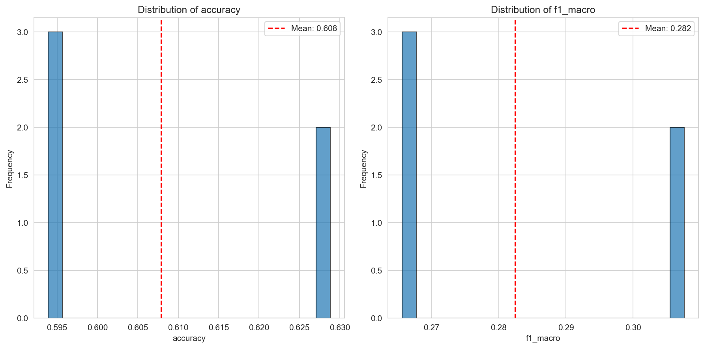
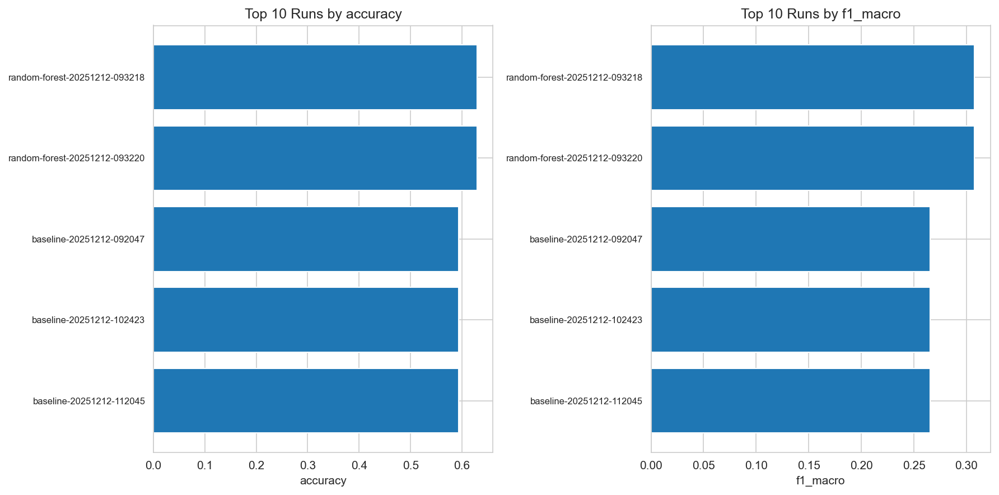

# Отчет об экспериментах: wine-quality

**Дата генерации:** 2025-12-12 11:41:09 UTC

**Всего экспериментов:** 5
**Успешных:** 5
**Неудачных:** 0

## Общая статистика

### accuracy

- **Среднее:** 0.6079
- **Медиана:** 0.5939
- **Стандартное отклонение:** 0.0191
- **Минимум:** 0.5939
- **Максимум:** 0.6288

### f1_macro

- **Среднее:** 0.2824
- **Медиана:** 0.2656
- **Стандартное отклонение:** 0.0230
- **Минимум:** 0.2656
- **Максимум:** 0.3076

## Топ 5 моделей по метрикам

### accuracy

- **random-forest-20251212-093220**: 0.6288
- **random-forest-20251212-093218**: 0.6288
- **baseline-20251212-112045**: 0.5939
- **baseline-20251212-102423**: 0.5939
- **baseline-20251212-092047**: 0.5939

### f1_macro

- **random-forest-20251212-093220**: 0.3076
- **random-forest-20251212-093218**: 0.3076
- **baseline-20251212-112045**: 0.2656
- **baseline-20251212-102423**: 0.2656
- **baseline-20251212-092047**: 0.2656

## Сравнительная таблица

Полная таблица сохранена в `experiment_results.csv`

## Визуализации

