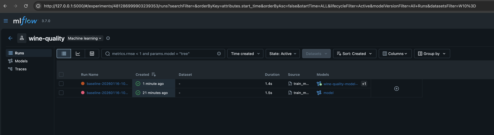
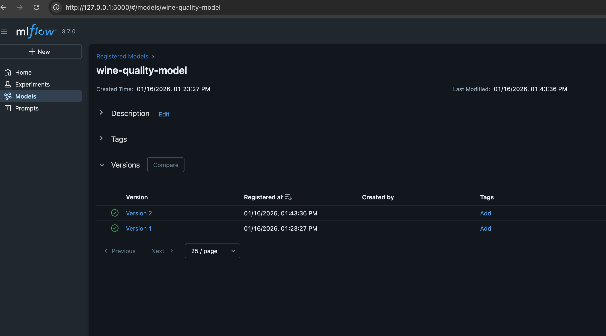
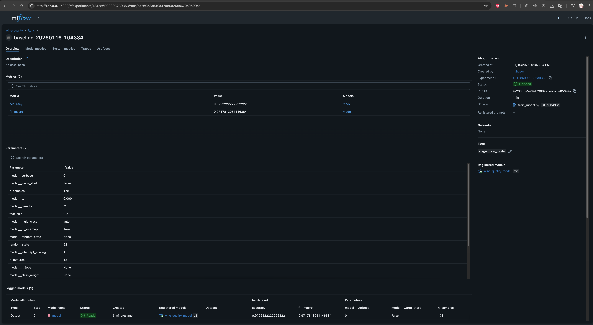

# ДЗ 4 — Автоматизация ML пайплайнов

## Выбранные инструменты

### Инструмент оркестрации
**DVC Pipelines** — Data Version Control pipelines для управления зависимостями между этапами ML пайплайна, кэширования результатов и автоматизации выполнения.

### Инструмент управления конфигурациями
**Hydra** — Configuration management framework от Facebook Research с поддержкой композиции конфигураций через `defaults`, иерархической структуры и CLI overrides.

## Настройка DVC Pipelines

### Структура пайплайна (DAG)

```
                   +--------------+
                   | prepare_data |
                   +--------------+
                  ***             **
                **                  ***
              **                       **
+--------------------+             +-------------+
| compute_statistics |             | train_model |
+--------------------+             +-------------+
                                          *
                                          *
                                          *
                                    +-----------+
                                    | visualize |
                                    +-----------+
```

### Этапы пайплайна
1. **prepare_data** — подготовка и масштабирование данных
2. **train_model** — обучение модели (независим от compute_statistics)
3. **compute_statistics** — расчёт статистик датасета (независим от train_model)
4. **visualize** — визуализация метрик

### Независимые этапы (параллельная структура DAG)

Этапы `train_model` и `compute_statistics` независимы друг от друга — оба зависят только от `prepare_data`. Это позволяет запускать их параллельно в отдельных терминалах:

```bash
# Терминал 1: обучение модели
dvc repro train_model

# Терминал 2: расчёт статистик (одновременно)
dvc repro compute_statistics

# Или последовательный запуск всего пайплайна
dvc repro
```

Проверка независимости этапов:
```bash
$ dvc dag
                   +--------------+
                   | prepare_data |
                   +--------------+
                  ***             **
                **                  ***
              **                       **
+--------------------+             +-------------+
| compute_statistics |             | train_model |
+--------------------+             +-------------+
```

## Настройка Hydra

### Установка
```toml
# pyproject.toml
dependencies = [
    "hydra-core==1.3.2",
]
```

### Композиция конфигураций через defaults

Базовая конфигурация `conf/config.yaml`:
```yaml
data:
  feature_scaling: true

train:
  random_state: 13
  test_size: 0.2
  model:
    type: logistic_regression
    logistic_regression:
      max_iter: 500
      C: 1.0
```

Специализированная конфигурация `conf/config_rf.yaml` с наследованием:
```yaml
#@package _global_
defaults:
  - config  # Наследует базовую конфигурацию

train:
  model:
    type: random_forest
    random_forest:
      n_estimators: 100
      max_depth: 10
```

### Использование Hydra Compose API

```python
# src/utils/config.py
from hydra import compose, initialize_config_dir
from hydra.core.global_hydra import GlobalHydra
from omegaconf import OmegaConf

def load_config(config_path, config_name="config", overrides=None):
    GlobalHydra.instance().clear()
    with initialize_config_dir(config_dir=str(config_path)):
        cfg = compose(config_name=config_name, overrides=overrides or [])
        return OmegaConf.to_container(cfg, resolve=True)
```

### Доступные конфигурации моделей
- `conf/config.yaml` — Logistic Regression (baseline)
- `conf/config_rf.yaml` — Random Forest
- `conf/config_svm.yaml` — SVM
- `conf/config_logistic.yaml` — Logistic Regression (альтернативные параметры)

## Система мониторинга

### Реализация
- Модуль `src/utils/monitoring.py`
- Логирование в `experiments.log`
- Структурированные временные метки

### Пример лога
```
================================================================================
Pipeline stage started: train_model
Timestamp: 2026-01-16T17:41:38.575819+00:00
Configuration: {'model_type': 'logistic_regression'}
================================================================================
Pipeline stage completed: train_model
Metrics: {'accuracy': 0.594, 'f1_macro': 0.266}
================================================================================
```

## Скриншоты

### MLflow Experiments


### MLflow Model Registry


### Детали эксперимента


## Воспроизводимость

### Быстрый старт
```bash
# Установка зависимостей
uv sync --frozen

# Запуск пайплайна
dvc repro

# Принудительный перезапуск
dvc repro --force
```

### Запуск с разными моделями
```bash
# Random Forest
PYTHONPATH=. uv run python src/models/train_model.py \
  data/processed/wine_processed.csv models/model.pkl reports/metrics.json \
  --config-path conf/config_rf.yaml

# SVM
PYTHONPATH=. uv run python src/models/train_model.py \
  data/processed/wine_processed.csv models/model.pkl reports/metrics.json \
  --config-path conf/config_svm.yaml
```

### Просмотр результатов
```bash
# DAG пайплайна
dvc dag

# Метрики
dvc metrics show

# Логи мониторинга
tail -20 experiments.log
```

## Структура проекта

```
conf/
  ├── config.yaml          # Базовая конфигурация (Hydra)
  ├── config_logistic.yaml # Logistic Regression
  ├── config_rf.yaml       # Random Forest (defaults: config)
  └── config_svm.yaml      # SVM (defaults: config)

src/
  ├── data/
  │   ├── make_dataset.py      # prepare_data
  │   └── compute_statistics.py # compute_statistics
  ├── models/
  │   └── train_model.py       # train_model
  ├── visualization/
  │   └── visualize.py         # visualize
  └── utils/
      ├── config.py            # Hydra compose API
      └── monitoring.py        # Pipeline monitoring

dvc.yaml                   # Определение пайплайна
experiments.log            # Лог выполнения
```
